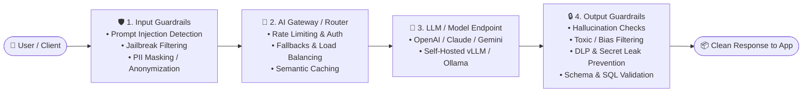

# 🛡️ Awesome-LLM-Firewall

### ⚡ Top LLM Firewall, AI Guardrails & Runtime Security Ecosystem

  
  
  
  
  
  
  

**A curated, production-tested index of enterprise SaaS platforms and high-star open-source frameworks for Large Language Model (LLM) Firewalls, Guardrails, AI Gateways, and AI Runtime Security.**

*Defending generative AI against Prompt Injections, Jailbreaks, Data Loss (DLP), Hallucinations, Toxic Generations, and OWASP Top 10 for LLMs.*

📅 **Last updated: September 2026**

---

## 📑 Table of Contents

- [🔍 Overview & Threat Model](#-overview--threat-model)
- [🏢 SaaS & Hosted LLM Firewalls](#-saashosted-llm-firewalls)
- [💻 Open-Source GitHub Projects](#-open-source-github-projects)
- [🛡️ Key Defense Capabilities & Architecture](#️-key-defense-capabilities--architecture)
- [⚠️ OWASP Top 10 for LLM Threat Matrix](#️-owasp-top-10-for-llm-threat-matrix)
- [🤝 How to Contribute](#-how-to-contribute)
- [📈 Star History](#-star-history)
- [📜 Disclaimer](#-disclaimer)

---

## 🔍 Overview & Threat Model

An **LLM Firewall** (or **AI Guardrail**) operates as an inline reverse proxy or runtime security SDK between client applications, end-users, and generative Foundation Models (such as OpenAI GPT-4o/o3, Anthropic Claude 3.5/3.7, Google Gemini 2.0/3.0, and Meta Llama 3).

### Key Protection Pillars:
- 🚫 **Prompt Injection & Jailbreak Neutralization:** Real-time classification and heuristics blocking malicious adversarial inputs and role-reversal attacks.
- 🔒 **Data Loss Prevention (DLP) & PII Masking:** Anonymizing customer secrets, credentials, API keys, and sensitive entities before model ingestion.
- 🎯 **Hallucination & Groundedness Verification:** RAG context comparison, factual consistency scoring, and semantic boundary checking.
- 🧱 **Deterministic Schema & Action Enforcement:** Ensuring structured JSON/SQL outputs and sandboxing autonomous tool/agent invocations.

---

## 🏢 SaaS/Hosted LLM Firewalls

> 📊 **Market Size & Industry Dynamics (2026):**  
> The global **AI Security & LLM Firewall** market is estimated at **$3.2 Billion in 2026** and projected to reach **$22.8 Billion by 2032** (growing at a rapid CAGR of ~38.7%). The sector is currently **moderately fragmented** with an aggressive consolidation wave where established enterprise cybersecurity titans (*Palo Alto Networks, Check Point, F5, SentinelOne, CrowdStrike*) are acquiring pure-play AI firewall and guardrail startups, while fast-growing independent gateways and developer-first platforms maintain specialized market dominance.

*Below are the category-leading SaaS/Hosted LLM Firewall and Guardrail platforms, sorted in descending order by company size / enterprise scale / valuation.*

| Platform / Product | Company Scale / Valuation | Description / Core Focus | Pricing (Starting Tier) | Free Tier Limits / Free Trial |
| :--- | :--- | :--- | :--- | :--- |
| **[Protect AI](https://protectai.com/)** | 🦄 **~$110B MCap** *(Parent: Palo Alto Networks; Acquired for ~$500M)* | Comprehensive AI-SPM platform covering ML model security scanning (Guardian/Radar/Sightline), supply-chain risks, and runtime AI protection. Origin of the open-source LLM Guard scanner. | **Enterprise Platform:** Starts at ~$25,000/year (AWS Marketplace contract) **LLM Guard Library:** Free & open-source (MIT) | **14-day Guided Proof-of-Concept / Trial:** Scoped to 5 models or 50,000 scanned requests **Unlimited free self-hosted usage** via open-source LLM Guard library. |
| **[Lakera Guard](https://www.lakera.ai/)** | 🛡️ **~$22B MCap** *(Parent: Check Point Software; Acquired)* | Ultra-low-latency runtime security API (<30ms) powered by extensive proprietary injection attack intelligence (Gandalf dataset) for prompt injection, jailbreak, and DLP defense. | **Community:** $0/mo **Enterprise:** Starts at ~$50,000/year (custom contract via AWS Marketplace / Sales) | **Free Forever (Community Plan):** 10,000 API requests/month with full prompt injection, jailbreak, and DLP detection + dashboard reporting. |
| **[CalypsoAI](https://calypsoai.com/)** | 🌐 **~$15B MCap** *(Parent: F5 Networks; Acquired)* | Enterprise GenAI security and governance platform (Moderator) delivering granular policy enforcement, audit logging, data redaction, and prompt firewalling. | **Enterprise Subscription:** Starts at ~$30,000/year (custom enterprise contract via F5) | **14-day Evaluation Sandbox:** Hands-on demo sandbox access with full policy configuration and up to 5,000 test prompt evaluations. |
| **[Prompt Security](https://www.prompt.security/)** | ⚡ **~$7.5B MCap** *(Parent: SentinelOne Singularity; Acquired)* | Complete GenAI runtime defense platform protecting employees and LLM apps from prompt injection, shadow AI, data privacy loss, and malicious agent plugins. | **Enterprise Contract:** Starts at ~$15,000/year (per-seat / workload licensing via SentinelOne) | **14-day to 30-day Proof-of-Concept Sandbox:** Evaluation access for up to 100 employee seats / 25,000 prompt inspections. |
| **[Aporia](https://www.aporia.com/)** | 🔭 **~$1.5B Valuation** *(Parent: Coralogix; Acquired)* | Real-time AI guardrails (<20ms latency) and full-lifecycle observability for LLMs, hallucination suppression, PII redaction, and compliance tracking. | **Starter / Team:** Starts at ~$1,000/month (~$12,000/year) **Enterprise:** Custom scale-based contracts | **14-day Free Trial:** Full platform access including real-time guardrails, monitoring, and up to 10,000 prediction/evaluation requests. |
| **[Pangea AI Guard](https://pangea.cloud/)** | 🚀 **~$280M Valuation** *(Raised $52M; GV / Ballistic)* | API-first composable security services providing AI Guard, Prompt Guard, and Secure Audit Log for prompt injection filtering, PII sanitization, and policy enforcement. | **Pay-As-You-Go:** Starts at $0.001 per request ($1.00 / 1,000 requests) or $0.0001 per scanned token **Enterprise Credits:** Starts at $500 minimum commitment | **Free Forever Account:** $5/month complimentary usage credit (~5,000 requests/month) with standard API rate limits (100 req/day burst during development). |
| **[Fiddler AI](https://www.fiddler.ai/)** | 🔬 **~$260M Valuation** *(Raised $45M; Insight / Lightspeed)* | Enterprise AI observability and runtime guardrails (<80ms latency) with specialized evaluators for toxicity, PII/PHI leakage, prompt injection, and hallucinations. | **Free Guardrails:** $0/mo **Developer (Observability):** $0.002 per trace **Enterprise:** Custom quote-based annual contracts | **Free Forever Plan:** Unlimited real-time guardrail filtering (prompt injection, jailbreak, PII/PHI, toxicity; excludes trace storage) **14-day Free Trial** for full observability suite. |
| **[HiddenLayer](https://hiddenlayer.com/)** | 🔒 **~$220M Valuation** *(Raised $55M; M12 / Microsoft)* | AI Security Platform (AISec) providing automated ML/LLM model scanning, adversarial attack detection, prompt injection defense, and runtime firewalling. | **AISec Platform:** Starts at ~$20,000/year (AWS/Azure Marketplace unit-based contract licensing) | **30-day Enterprise Proof-of-Value (POV):** Full runtime & scanning evaluation for up to 2 production models upon sales qualification. |
| **[Portkey AI Gateway](https://portkey.ai/)** | 🚦 **~$90M Valuation** *(Raised $18M; Lightspeed / Elevation)* | Production AI Gateway with integrated guardrails, enterprise traffic routing, automated fallbacks, semantic caching, load balancing, and prompt management. | **Developer:** $0/mo **Production:** Starts at $49/month (includes 100,000 recorded logs) **Enterprise:** Custom quotes | **Free Forever (Developer Plan):** 10,000 recorded logs/month (traffic continues unblocked beyond limit), 3-day log retention, 30-day metrics, 3 prompt templates. |

---

## 💻 Open-Source GitHub Projects

*The open-source ecosystem provides transparent, programmable, self-hostable, and air-gapped protection for LLM applications. Sorted strictly in descending order by GitHub Star count.*

| Repository & Tool | Stars | Category & Architecture | Key Strengths & Guardrail Features |
| :--- | :--- | :--- | :--- |
| **[LiteLLM](https://github.com/BerriAI/litellm)** |  | 🚦 **AI Proxy & Gateway** | High-throughput OpenAI-compatible proxy supporting 100+ LLMs with built-in guardrails (Llama Guard, Guardrails AI, Presidio PII, Lakera, Aporia, and custom webhook filters). |
| **[Promptfoo](https://github.com/promptfoo/promptfoo)** |  | 🎯 **Red Teaming & Evaluation** | Fast CLI and testing framework for evaluating LLM outputs, automated dynamic red-teaming, prompt injection vulnerability scanning, and CI/CD security regression tests. |
| **[DeepEval](https://github.com/confident-ai/deepeval)** |  | 🧪 **LLM Evaluation & Guardrails** | Production-grade evaluation framework for LLMs with 14+ guardrail metrics (hallucination, answer relevancy, toxicity, bias, PII leakage, and RAG evaluation). |
| **[Portkey AI Gateway](https://github.com/Portkey-AI/gateway)** |  | ⚡ **High-Speed AI Gateway** | Ultra-fast (sub-millisecond overhead) gateway written in TypeScript; handles retries, canary rollouts, streaming fallbacks, and real-time guardrail hooks. |
| **[garak](https://github.com/leondz/garak)** |  | 🔬 **Vulnerability Scanner** | The "Nmap for LLMs" (NVIDIA/community); probes LLM models, agents, and guardrails for prompt injection, jailbreaks, data hallucination, package hallucination, and bias. |
| **[Guardrails AI](https://github.com/guardrails-ai/guardrails)** |  | 🛡️ **Validation & Guardrail Engine** | Framework for enforcing structural, type, and quality guarantees on LLM outputs (Guardrails Hub ecosystem with 50+ community validators for PII, SQL injection, toxicity). |
| **[NVIDIA NeMo Guardrails](https://github.com/NVIDIA/NeMo-Guardrails)** |  | 🧱 **Programmable Dialog Rails** | Open-source toolkit by NVIDIA using Colang for building programmable guardrails: dialog flow control, topical moderation, jailbreak checks, and safety rails. |
| **[Giskard](https://github.com/giskard-ai/giskard)** |  | 🔍 **Quality & Security Testing** | Open-source testing framework that automatically detects vulnerabilities in LLMs (prompt injections, hallucinations, data leaks, stereotypes, and robustness issues). |
| **[PyRIT](https://github.com/microsoft/PyRIT)** |  | ⚔️ **AI Red Teaming Framework** | Python Risk Identification Tool for generative AI by Microsoft; automates red teaming against multi-turn chat, multimodal endpoints, and prompt injection filters. |
| **[Purple Llama / Llama Guard](https://github.com/meta-llama/PurpleLlama)** |  | 🦙 **Meta AI Safety Suite** | Meta's suite of open trust and safety models, including **Llama Guard** (input/output safety classifier), **PromptGuard** (injection detector), and **CyberSecEval**. |
| **[TruLens](https://github.com/truera/trulens)** |  | 📐 **RAG & Agent Feedback Rails** | Evaluation and guardrail instrumentation for LLM apps using the "RAG Triad" (context relevance, groundedness, answer relevance) and guardrail hooks. |
| **[LLM Guard](https://github.com/protectai/llm-guard)** |  | 🛡️ **Zero-Trust Security Toolkit** | Comprehensive, lightweight Python library by Protect AI for sanitizing prompts and outputs: scans for prompt injection, secret leaks, toxicity, PII, and banned topics. |
| **[Rebuff](https://github.com/protectai/rebuff)** |  | 🪤 **Self-Hardening Prompt Firewall** | Multi-layer prompt injection detector combining heuristic analysis, LLM classification, vector database lookups of known attacks, and canary word injection. |

---

## 🛡️ Key Defense Capabilities & Architecture

### 1. Direct & Indirect Prompt Injection Defense
- **Heuristic & Signature Detectors:** Identifies adversarial patterns, role reversal tokens (`Ignore previous instructions`), and jailbreak triggers.
- **Canary Tokens:** Injects cryptographic canary strings into system instructions to detect if internal context was leaked in the response.
- **Dedicated Guard Models:** Runs lightweight classification models (*Llama Guard, PromptGuard, Lakera*) before forwarding prompts.

### 2. Data Loss Prevention (DLP) & PII Redaction
- **Pre-execution Scrubbing:** Automatically scrubs SSNs, API keys, passwords, credit card numbers, and health records before prompts hit external LLM APIs.
- **Output Masking:** Prevents models from inadvertently repeating sensitive training data or confidential retrieval context.

### 3. Output Validation & Hallucination Mitigation
- **Groundedness & Context Verification:** Compares generation against retrieved documents in RAG pipelines to verify factual accuracy.
- **Format & Grammar Validation:** Ensures generated output strictly conforms to JSON, Pydantic, or SQL schemas, preventing code-execution attacks.

---

## ⚠️ OWASP Top 10 for LLM Threat Matrix

| OWASP LLM Vulnerability | Primary Threat Vector | Firewall / Guardrail Mitigation |
| :--- | :--- | :--- |
| **LLM01: Prompt Injection** | Crafting inputs to manipulate LLM behavior or hijack instructions | Real-time classifiers (PromptGuard, Lakera), canary tokens, input sanitizers |
| **LLM02: Sensitive Information Disclosure** | Leaking private customer PII, secrets, or internal training data | Pre/post DLP scanners (Presidio, LLM Guard), token anonymizers |
| **LLM03: Supply Chain Vulnerabilities** | Poisoned pre-trained weights, compromised packages, or models | Model scanners (Protect AI Guardian, HiddenLayer ModelScanner) |
| **LLM04: Data and Model Poisoning** | Malicious data introduced in fine-tuning or RAG pipelines | Dataset integrity checks, embedding validation, automated red teaming |
| **LLM05: Improper Output Handling** | Unsanitized model output leading to XSS, SQLi, or remote execution | Structural schema validation (Guardrails AI, NeMo Colang output rails) |
| **LLM06: Excessive Agency** | Granting autonomous agents dangerous or unvalidated tool access | Deterministic policy engines, human-in-the-loop gates, bounded permissions |
| **LLM07: System Prompt Leakage** | Attackers extracting secret system instructions & business logic | Output inspection, canary leak detection, prompt confidentiality rails |
| **LLM08: Vector and Embedding Weaknesses** | Vector store poisoning, malicious retrieval manipulation in RAG | Similarity thresholding, document source verification, context checks |
| **LLM09: Misinformation & Hallucination** | Model generating false facts, fabricated citations, or toxic statements | RAG triad evaluation (DeepEval, TruLens), real-time factual grounders |
| **LLM10: Unbounded Consumption** | Resource exhaustion, DDoS, excessive token usage leading to high bills | AI Gateway rate limiters, token budgets, request timeout policies |

---

## 🤝 How to Contribute

We welcome contributions from security engineers, AI practitioners, and open-source maintainers! 🚀

1. 🍴 **Fork the repository**
2. 🌿 **Create a feature branch:** `git checkout -b feature/add-new-firewall`
3. 📝 **Add your entry** following the table format (include official links, pricing, free tier limits, star badges, and factual summaries)
4. 📬 **Submit a Pull Request** with a brief summary of the changes

---

## 📈 Star History

---

## 📜 Disclaimer

- This list is **community-curated** for research, operational engineering, and educational purposes. Inclusion does not constitute an endorsement.
- Generative AI security is an adversarial and rapidly evolving domain. **No single firewall eliminates all risk.** Always employ a defense-in-depth approach combining runtime guardrails, least-privilege tool design, human-in-the-loop oversight, and routine automated red-teaming.

---

**Built with ❤️ for AI Security Engineers, Platform Teams & GenAI Builders.**

*Let's keep AI interactions secure, robust, and auditable.*

